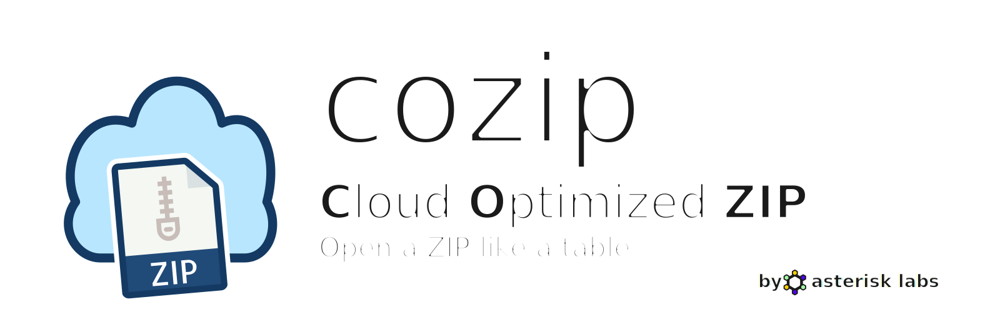

<div align="center">
  
  <p>
    <a href="LICENSE"></a>
    <a href="https://pypi.org/project/cozip"></a>
    <a href="https://asterisk-labs.r-universe.dev/cozip"></a>
    <a href="https://github.com/asterisk-labs/AsteriskRegistry"></a>
    <a href="SPEC.md"></a>
    <a href="https://github.com/asterisk-labs/cozip_reader"></a>
  </p>
</div>

---

Open a ZIP like a table. Still a ZIP, now queryable.

cozip glues a Parquet manifest onto an ordinary ZIP and drops a tiny fixed index at byte 0 that points to it. Fetch the index, fetch the manifest, query it locally, then range-request just the bytes you actually want. A 20 GB archive becomes a queryable dataset in two reads.

<div align="center">
  
</div>

It works because nothing about the ZIP changes. `unzip` works. `zipfile.ZipFile` works. Your OS preview pane works. The manifest is just the first entry, and any conforming ZIP reader walks right past it.

## Example

```python
import cozip
import pyarrow as pa

table = pa.table({
    "path":  ["local/tile_001.tif", "local/tile_002.tif", "local/tile_003.tif"],
    "name":  ["tile_001.tif", "tile_002.tif", "tile_003.tif"],
    "split": ["train", "val", "train"],
    "label": ["cloud", "water", "forest"],
})

cozip.write("dataset.zip", table)

manifest = cozip.read("https://example.com/dataset.zip")
train = manifest.filter(pa.compute.equal(manifest["split"], "train"))
```

`path` says where each file lives on disk. `name` is how it shows up inside the archive. Everything else rides along into the manifest and becomes queryable on read. R and Julia have the same API, see their READMEs.

## Bindings

| Language | Install | Role | Docs |
|----------|---------|------|------|
| Python   | `pip install cozip` | read + write | [python/](python/) |
| R        | `install.packages("cozip", repos = "https://asterisk-labs.r-universe.dev")` | read + write | [r/](r/) |
| Julia    | `Pkg.Registry.add("https://github.com/asterisk-labs/AsteriskRegistry"); Pkg.add("Cozip")` | read + write | [julia/](julia/) |
| C        | vendor [`core/`](core/) (libzip + zlib bundled, zero system deps) | **core writer** | [core/](core/) |
| C++ / DuckDB | `INSTALL cozip FROM community; LOAD cozip;` | **reader** via `read_cozip()` | [asterisk-labs/cozip_reader ↗](https://github.com/asterisk-labs/cozip_reader) |

The C library at [`core/`](core/) is the writer core — Python, R, and Julia all wrap it, so a cozip written in any of them is byte-for-byte identical. The C++ reader lives in a separate repo, [asterisk-labs/cozip_reader](https://github.com/asterisk-labs/cozip_reader), built as a DuckDB community extension: it exposes `read_cozip(url)` to SQL, works native and in WebAssembly, and ranges files directly out of HTTPS/S3/HuggingFace. Both follow the same [SPEC.md](SPEC.md).

## Spec

See [SPEC.md](SPEC.md). The format is short and stable. Any conforming reader handles any conforming writer.

## License

MIT.

<div align="center">
  <br>
  Made with ♥ by
  <br><br>
  <a href="https://asterisk.coop">
    
  </a>
</div>