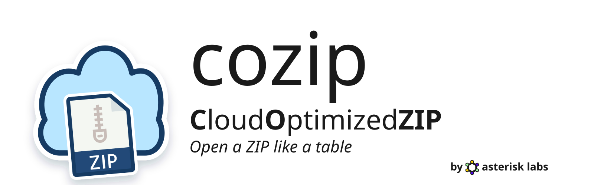

<div align="center">
  
  <p>
    <a href="LICENSE"></a>
    <a href="https://pypi.org/project/cozip"></a>
    <a href="https://asterisk-labs.r-universe.dev/cozip"></a>
    <a href="https://github.com/asterisk-labs/AsteriskRegistry"></a>
    <a href="https://www.npmjs.com/package/@asterisk-labs/cozip"></a>
    <a href="SPEC.md"></a>
    <a href="https://github.com/asterisk-labs/cozip_reader"></a>
  </p>
</div>

---

Open a ZIP like a table.

cozip adds a Parquet manifest to an ordinary ZIP and puts a small fixed index
at byte 0. A reader fetches the index and manifest first, then requests only
the payload bytes it needs.

<div align="center">
  
</div>

A cozip remains a valid ZIP file: `unzip`, `zipfile.ZipFile`, and ordinary ZIP
tools still work.

## Example

```python
import tempfile
from pathlib import Path

import numpy as np
import pyarrow as pa
import rasterio
import cozip


# 1. Three tiny GeoTIFFs: all-zeros, all-ones, all-twos. (your dataset)
tmp = Path(tempfile.mkdtemp())
labels = ["zeros", "ones", "twos"]
paths = [tmp / f"{label}.tif" for label in labels]

profile = dict(driver="GTiff", dtype="uint8", count=1, width=64, height=64,
               crs="EPSG:4326", transform=rasterio.Affine.identity())
for v, p in enumerate(paths):
    with rasterio.open(p, "w", **profile) as dst:
        dst.write(np.full((64, 64), v, "uint8"), 1)

# 2. Pack with a table.
archive = str(tmp / "dataset.zip")
cozip.write(archive, pa.table({
    "path":  [str(p) for p in paths],
    "name":  [p.name for p in paths],
    "split": ["train", "val", "train"],
    "label": labels,
}))

# 3. Read manifest
manifest = cozip.read(archive)
for _, row in manifest[manifest["split"] == "train"].iterrows():
    with rasterio.open(row["cozip:gdal_vsi"]) as src:
        print(row["name"], src.read(1).mean())
```

`path` says where each file lives on disk. `name` is how it appears inside the
archive. Everything else is optional metadata. The writer adds `offset` and
`size`; the reader can also add `cozip:gdal_vsi`, a
[GDAL VSI](https://gdal.org/en/stable/user/virtual_file_systems.html) path.


## Bindings

| Language | Install | Role | Docs |
|----------|---------|------|------|
| Python   | `pip install cozip` | read + write | [python/](python/) |
| R        | `install.packages("cozip", repos = "https://asterisk-labs.r-universe.dev")` | read + write | [r/](r/) |
| Julia    | `Pkg.Registry.add("https://github.com/asterisk-labs/AsteriskRegistry"); Pkg.add("Cozip")` | read + write | [julia/](julia/) |
| JavaScript | `npm install @asterisk-labs/cozip` | **reader** | [javascript/](javascript/) |
| C        | vendor [`core/`](core/) (libzip + zlib bundled, zero system deps) | **core writer** | [core/](core/) |
| C++ / DuckDB | `INSTALL cozip FROM community; LOAD cozip;` | **reader** via `read_flat()` | [asterisk-labs/cozip_reader](https://github.com/asterisk-labs/cozip_reader) |

The C library at [`core/`](core/) is the writer core. Its public API also
provides the two-stage TACO layout/write path described in
[`docs/taco-writer-internal.md`](docs/taco-writer-internal.md). Python, R, and
Julia use libcozip for layout and ZIP serialization. Two readers live outside that C path:
the DuckDB community extension at
[asterisk-labs/cozip_reader](https://github.com/asterisk-labs/cozip_reader)
exposes `read_flat(url)` to SQL, and [`javascript/`](javascript/) reads HTTP
archives in browser and server runtimes. All follow the same [SPEC.md](SPEC.md).

## Spec

See [SPEC.md](SPEC.md). Any conforming reader handles any conforming writer.

## License

MIT.

<div align="center">
  <br>
  Made with ♥ by
  <br><br>
  <a href="https://asterisk.coop">
    
  </a>
</div>
